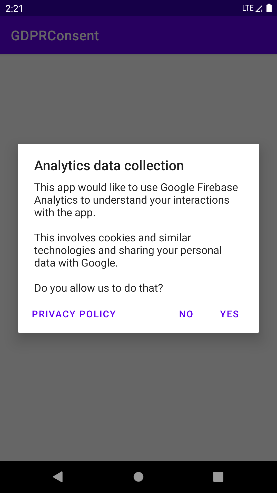

# App Consent

This repository shall help app developers implement consent in apps correctly. This helps
compliance with the GDPR, CCPA and other legal regimes.

Specifically, it targets the following compliance problems:

- Failure to to implement any consent flows
- Sharing of data with third-party companies without consent (violating Articles 7 and (35)1 GDPR)
- Non technically-necessary accessing or storing of data on smartphone (violating Article 5(3) ePrivacy Directive)
- Sharing more data than necessary (violating Article 4(1) GDPR)

The motivation for this project that our research at Oxford found that less than 4% of Android apps implement any form of consent: <https://www.usenix.org/conference/soups2021/presentation/kollnig>

At the moment, this project automatically implements a consent flow if your app uses one of the following SDKs:

- Google Firebase Analytics
- Facebook SDK
- AppLovin
- Google Play Services Advertising Identifier Library

*Note that the use of Google and Facebook services in the EU is [likely illegal even with user consent](https://noyb.eu/en/austrian-dsb-eu-us-data-transfers-google-analytics-illegal), because data is sent to the US and can be used for unlawful surveillance of EU citizens.*



## Installation

1. Add the JitPack repo:
```gradle
allprojects {
      repositories {
            ...
            maven { url 'https://jitpack.io' }
      }
}
```
2. Add the library:
```gradle
dependencies {
        implementation 'com.github.kasnder:app-consent-android:0.3'
}
```
3. Initialise the library by calling
```java
ConsentManager consentManager =
      new ConsentManager.Builder(this)
            .setPrivacyPolicy(Uri.parse("http://www.example.org/privacy"))
            .build();
```
4. If you want to, you can change the title (or message) in the consent flow by changing the `consent_title` (or `consent_msg`) string.

You can check the example project in `app/` to see how the library is used.

The project also disables the sharing of analytics data with Google Ads, which is enabled by default.
If you need this functionality, you can add the following to your `<application>` tag in your `AndroidManifest.xml` file:

```xml
<meta-data android:name="google_analytics_default_allow_ad_personalization_signals" tools:node="remove"/>
<meta-data android:name="google_analytics_adid_collection_enabled" tools:node="remove" />
```

Similarly, the tool, by default, disables the collection of the Android Advertise ID in the Facebbok SDK, unless this behaviour is explicitly disabled as follows.

```xml
<meta-data android:name="com.facebook.sdk.AdvertiserIDCollectionEnabled" tools:node="remove"/>
```
